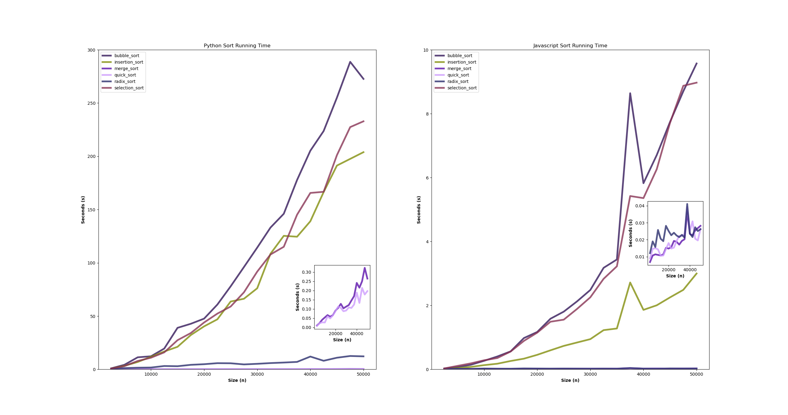

<h1> Sorting-Algorithm-Analysis </h1>

 Sorting algorithm time analysis using two programming languages, Nodejs and Python. 

 Sorting algorithms used : 

<ul>
  <li> Insertion Sort </li>
  <li> Selection Sort </li>
  <li> Bubble Sort </li>
  <li> Merge Sort </li>
  <li> Quick Sort </li>
  <li> Radix Sort </li>
</ul>

 Dummies data can be created using ./data_create.py 

 Get the run time using ./main.bash  

 Plot the results using ./visualized.py  

 Sample results: 

